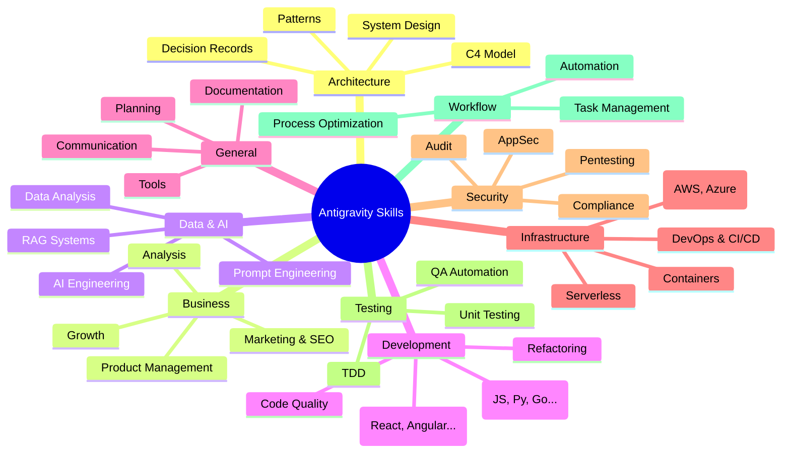

# Hướng Dẫn Sử Dụng Skills (Kỹ Năng) Trong Dự Án

## 1. Cách Sử Dụng Skills

Để sử dụng các skills (kỹ năng) có sẵn trong dự án này, bạn có thể tương tác trực tiếp với Agent (Antigravity). Các skills này giúp Agent thực hiện các tác vụ chuyên biệt một cách chính xác hơn.

Có hai cách chính để kích hoạt một skill:

1.  **Sử dụng Ngôn ngữ Tự nhiên**:
    *   Bạn chỉ cần yêu cầu Agent thực hiện một tác vụ cụ thể. Agent sẽ tự động tìm và sử dụng skill phù hợp.
    *   Ví dụ: "Hãy lên kế hoạch cho dự án này" (Agent sẽ dùng skill `brainstorming` hoặc `planning`).
    *   Ví dụ: "Kiểm tra bảo mật cho file này" (Agent sẽ dùng skill `security-audit`).

2.  **Sử dụng Cú pháp `@skillname`** (Khuyến khích):
    *   Để đảm bảo Agent dùng đúng skill bạn muốn, hãy nhắc tên skill trong yêu cầu.
    *   Ví dụ: "Sử dụng skill **@architecture** để phân tích cấu trúc dự án."
    *   Ví dụ: "Dùng **@clean-code** để refactor hàm này."

## 2. Danh Sách Các Nhóm Skills

Dự án hiện có tổng cộng **713** skills, được chia thành các nhóm chính sau:

| Nhóm (Category) | Số lượng | Mô tả |
| :--- | :--- | :--- |
| **architecture** | 63 | Thiết kế hệ thống, ADRs, C4 model, patterns. |
| **business** | 38 | Phân tích thị trường, SEO, growth, marketing. |
| **data-ai** | 99 | AI engineering, RAG, prompt engineering, data analysis. |
| **development** | 82 | Ngôn ngữ lập trình, frameworks, code quality. |
| **general** | 131 | Kỹ năng chung, lập kế hoạch, viết tài liệu. |
| **infrastructure**| 83 | DevOps, cloud (AWS, Azure), CI/CD, docker. |
| **security** | 113 | Bảo mật ứng dụng, pentesting, compliance. |
| **testing** | 23 | TDD, unit test, integration test, QA. |
| **workflow** | 81 | Tự động hóa, quản lý tác vụ, quy trình làm việc. |

> **Lưu ý**: Để xem danh sách đầy đủ và chi tiết từng skill, bạn có thể tham khảo file [`CATALOG.md`](../CATALOG.md) trong thư mục gốc.

## 3. Bản Đồ Tư Duy (Mind Map)

Dưới đây là sơ đồ tư duy tổng quan về hệ thống skills trong dự án:

## 4. Ví Dụ Một Số Skills Phổ Biến

Dưới đây là một số skills thường xuyên được sử dụng:

*   **@brainstorming**: Lên ý tưởng và kế hoạch ban đầu.
*   **@clean-code**: Chuẩn hóa code theo nguyên lý Clean Code.
*   **@architecture**: Tư vấn và thiết kế kiến trúc hệ thống.
*   **@security-audit**: Kiểm tra lỗ hổng bảo mật.
*   **@prompt-engineer**: Tối ưu hóa câu lệnh (prompt) cho AI.
*   **@git-commit**: Tạo commit message chuẩn.
*   **@readme-generator**: Tạo file README chuyên nghiệp.

---
*Tài liệu này được tạo tự động bởi Antigravity Agent.*
